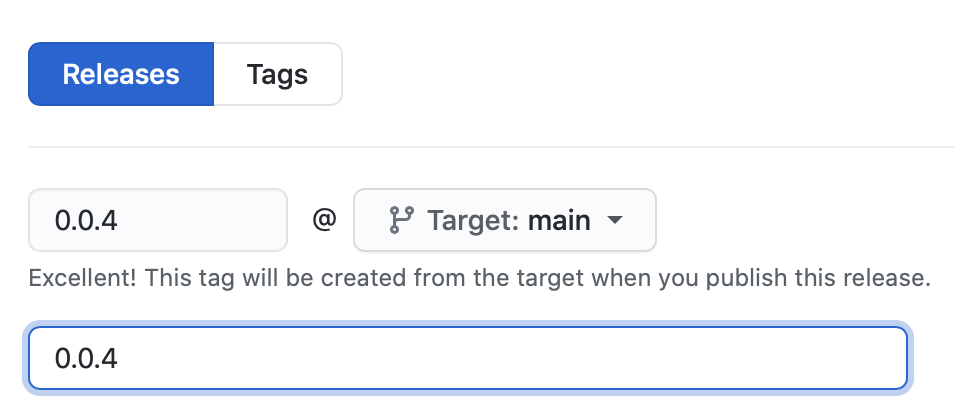

# Quartz Content Queries

This repo contains shared GraphQL queries for Quartz content at [content.qz.com/graphql](https://content.qz.com/graphql).

Queries are used to automatically generate TypeScript types and React hooks for React projects, and Swift types for iOS projects, using [Apollo](https://www.apollographql.com/docs/). This repo hosts both an [NPM package](/package.json) and a [Swift package](/Package.swift) for client use.

## Adding queries

Shared queries can be found in [`/Queries`](/Queries). Fragments that might be shared in multiple queries are grouped in [`/Queries/Fragments`](/Queries/Fragments). Queries related to a single page or function are grouped into folders, for instance, [`/Queries/Home`](/Queries/Home).

> What about `__typename`?

There’s no need to include `__typename` in your queries! Types will be introspected automatically.

### Generating type definitions

Type definitions are generated automatically when merging to the `main` branch. (See `.github/workflows/generation.yml`). However, it’s a good idea to run type generation locally before opening a PR; it can help catch errors like missing fragments or name collisions. If you’d like to test your PR in a consuming repo like `qz-react`, open the PR, wait for the bot to commit the type definitions, then install the resulting commit in your repo, e.g.:

```
npm i --save Quartz/content#mysha1
```

### Releases

We’re using GitHub Releases (tags) for versioning. Click on “Releases”, then “Draft a new release”, and tag and title your release using semantic versioning. To update the package in a client project, use: `npm i --save Quartz/content#0.0.8`.



## Client usage

### In React projects

```sh
npm i --save Quartz/content#0.1.0 # we’re using GitHub Releases (tags) for versioning
```

Hooks are automatically generated for each operation (query or mutation).

```jsx
import { useLatestGuidesQuery } from '@quartz/content';

export default function MyComponent() {
	const { data, loading, error } = useLatestGuidesQuery( { variables: { perPage: 3 } } );
```

### In iOS projects

```swift
// Package.swift
dependencies: [
    .package(url: "https://github.com/Quartz/content", from: "0.0.8"),
],
```
